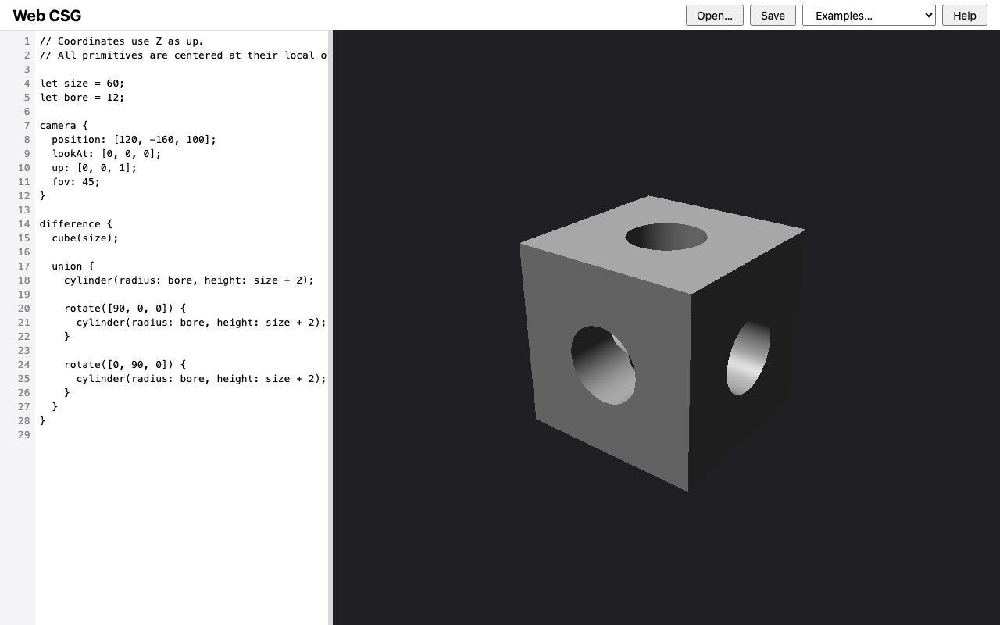

# Web CSG

A small constructive solid geometry (CSG) modeler that runs in the browser.
You describe a scene — primitives, transforms, Boolean operations, lights, and
a camera — in a compact declarative modeling language, and the app ray traces
it to a 2D `<canvas>` with a pure-JavaScript CPU renderer.

No build step, no runtime dependencies, no WebGL: the browser loads the ES
modules exactly as they are written, and every pixel is traced in plain
JavaScript you can read.



**Try it: <https://csg.ranton.org>** — it runs entirely in your browser, with
nothing to install. Desktop only, by design (DESIGN D11).

Web CSG is a **course exemplar** — a worked example of spec-driven
development, meant to be read, rebuilt from its specification, and extended.
[`DESIGN.md`](DESIGN.md) is the source of truth for behavior; the code
implements it.

## Quick start

Requires Node.js ≥ 22 and a current desktop Chrome, Firefox, or Safari.

```sh
npm install
npx playwright install   # browser binaries for the e2e suite
npm run hooks:install    # pre-commit hook that runs npm test

npm start                # serves the repo over HTTP; open the printed URL
```

`npm start` is required rather than opening `index.html` directly — ES modules
do not load from `file://`.

On first launch the editor contains the bored-cube example. Type in the left
pane; 300 ms after you stop, the model is rebuilt and rendered progressively
into the right pane. Errors are listed with line and column (click one to jump
the caret there) and the last valid image stays on screen, marked stale, so an
invalid edit never blanks the preview.

## The modeling language

```csg
// Coordinates use Z as up.
// All primitives are centered at their local origin.

let size = 60;
let bore = 12;

camera {
  position: [120, -160, 100];
  lookAt: [0, 0, 0];
  up: [0, 0, 1];
  fov: 45;
}

difference {
  cube(size);

  union {
    cylinder(radius: bore, height: size + 2);
    rotate([90, 0, 0]) { cylinder(radius: bore, height: size + 2); }
    rotate([0, 90, 0]) { cylinder(radius: bore, height: size + 2); }
  }
}
```

| | |
| --- | --- |
| Primitives | `sphere(radius)`, `cube(size)`, `box([x, y, z])`, `cylinder(radius, height)` |
| Transforms | `translate([x, y, z]) { … }`, `rotate([rx, ry, rz]) { … }` (degrees, OpenSCAD order), `scale(n) { … }` |
| Booleans | `union { … }`, `intersection { … }`, `difference { … }` (first solid minus the rest) |
| Scene blocks | `camera { position; lookAt; up; fov; }` (required, one), `light { direction \| position; intensity; }` (0–4), `material { color; }` (at most one) |
| Bindings | `let name = expr;` — immutable numbers and vectors, block scoped, no shadowing |
| Arithmetic | `+ - * /`, unary minus, parentheses; number/vector combinations only where they make sense |
| Comments | `// line` and `/* block */` |

Arguments may be positional (in the documented order) or named
(`cylinder(height: 62, radius: 12)`). Nesting in the source *is* nesting in
the CSG tree. The language is deliberately declarative and safe: no loops, no
user-defined functions, no imports, and no arbitrary JavaScript.

The full grammar, the semantics, and every numeric constant are specified in
[DESIGN §5 and §8](DESIGN.md#5-constants-and-configuration). The in-app
**Help** button shows the same reference.

The toolbar also carries **Open…** and **Save** (plain `.csg` text files) and
an **Examples…** picker with three built-in scenes: the bored cube, the four
primitives, and the three Boolean operations. Your current source is autosaved
to `localStorage` and restored on reload; the app still works when storage is
unavailable.

## How it works

Rendering is analytic, not marching: each primitive turns a ray into a sorted
list of `[t_enter, t_exit]` intervals in its own local space, the Boolean nodes
combine those interval lists (with cutter normals reversed for `difference`),
and the first visible hit is shaded with Blinn-Phong from the declared lights —
or from a default key light when the source declares none. One ray per CSS
pixel, through the pixel center.

The code is split along a boundary that is enforced by a test:

```text
src/core/   # DOM-free: lexer, parser, evaluator, transforms, primitives,
            # intervals, shading, render. Runs unchanged under Node.
src/ui/     # Browser shell: editor wiring, divider, progressive render job,
            # persistence, examples, help. Depends on core, never the reverse.
```

`src/core/render.js` is the public entry point — `compile(source)`,
`renderSource(source, width, height)`, and `renderRows(...)` — which is what
makes the renderer testable head-lessly and the shell thin. All numeric
constants live in `src/core/constants.js`, mirroring DESIGN §5; none are
invented or tuned in code. Rendering is deterministic: the same source and
canvas size produce the same pixels, every time.

The architecture boundaries and module map are recorded in
[CONSTRAINTS §2](CONSTRAINTS.md#2-architecture-and-boundaries).

## Testing

```sh
npm test                 # Node unit + golden-image tests
npm run test:e2e         # Playwright: Chromium, Firefox, WebKit
npm run check            # the full gate: both of the above
node --test test/core/intervals.test.js   # one file
```

Golden-image tests render fixed scenes at small sizes and compare them against
committed PPM files in `test/golden/`, every channel within 1. They are
regenerated only deliberately, with `npm run golden:update`, and the image diff
is reviewed in the same change.

Because this is a renderer, a green suite is not evidence of visual
correctness. `npm run capture -- <milestone>` writes screenshots to
`docs/progress/<milestone>/`, where each milestone's `README.md` records the
acceptance criteria checked, the gate result, and a manual Safari smoke check.

## Repository layout

```text
index.html                  # App entry page
src/core/                   # DOM-free core
src/ui/                     # Browser shell
test/                       # Node unit + golden tests; support/ helpers; golden/ PPMs
e2e/                        # Playwright specs
tools/                      # serve.mjs, capture.mjs, golden-update.mjs, hooks/
vercel.json                 # Static hosting for csg.ranton.org (no build step)
docs/progress/<milestone>/  # Captures and evidence
openspec/                   # Specifications and changes
templates/                  # Source templates for the planning documents
```

## Documents

| File | What it governs |
| --- | --- |
| [`DESIGN.md`](DESIGN.md) | What the project does: objectives, constants (§5), BDD feature specs (§8), open decisions (§12), parked features. Wins over every other document. |
| [`ROADMAP.md`](ROADMAP.md) | Milestones M0–M6, their "done when", and the cross-change backlog |
| [`CONSTRAINTS.md`](CONSTRAINTS.md) | Stack, architecture boundaries, determinism, workflow, commands; §5 is the definition of done, §6 is how it is judged |
| [`CLAUDE.md`](CLAUDE.md) | Entry point for AI agents working in the repo |
| [`vision.md`](vision.md) | The original high-level input. Historical; `DESIGN.md` supersedes it. |
| `openspec/` | Current behavior specifications and the change history |

Specifications are the source of truth. When code and spec disagree, the spec
wins or the spec gets changed — never a silent divergence. Planning runs
through OpenSpec (`/opsx:explore` → `propose` → `apply` → `archive`), one
branch per change, merged only after the full gate passes and a separate
adversarial Critic pass returns `[APPROVED]`.

## Status

Milestones M0–M6 are complete; M6 (persistence and examples) was the first
release. See [ROADMAP.md](ROADMAP.md) for the milestone table and the
remaining backlog.

Deliberately out of scope until specifically requested — the parked list in
[DESIGN](DESIGN.md#optional-features-parked), and the natural place to start
if you want to extend the project: non-uniform scaling, cone and torus
primitives, GPU acceleration, a live 3D viewport, mouse picking, an
orthographic camera, richer materials, colored lights, shadows, anti-aliasing
and HiDPI rendering, Web Worker rendering, syntax highlighting, and mobile and
touch support.

## License

MIT — see [LICENSE](LICENSE). Copyright (c) 2026 Richard Anton.
