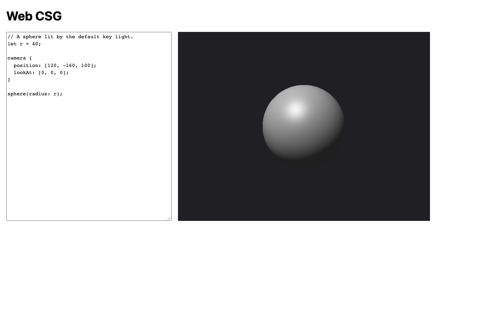

# M1 — First pixels: verification evidence

Change: `openspec/changes/m1-first-pixels` on branch `m1-first-pixels`.
Recorded 2026-09-10. Machine: macOS, Node v22.20.0, npm 10.9.3,
`@playwright/test` 1.63.0.

## Capture

`npm run capture -- M1` → `docs/progress/M1/app.png` (1280×800, Chromium,
device scale factor 1): the page with the example source beside the
640×480 preview of the shaded sphere.

## ROADMAP "done when" criteria

| Criterion | Evidence | Result |
| --- | --- | --- |
| A source with a camera and `sphere(…)` renders a shaded sphere in the browser on all three engines | `e2e/editor-preview.spec.js` › "the example renders on load": the center pixel is not the background, the corner is the background, there are no diagnostics, and no console errors. Run in Chromium, Firefox, and WebKit | Pass, 3/3 engines. Manual Safari check passed (below) |
| The core render function matches a committed sphere golden within 1 per channel | `test/core/render-golden.test.js` against `test/golden/sphere.ppm` (the default example at 64×48) and `sphere-inside.ppm` (the camera inside `sphere(50)`). Both images were inspected when created: the highlight is upper-left, as the key light's direction predicts, and the inside view is brightest toward the lower right, where the flipped normals face the key light | Pass |
| Rendering the same source at the same size twice gives identical pixels | `test/core/render.test.js` › "rendering is deterministic"; "rendering in bands equals one full render" | Pass |
| Every DESIGN §8 Modeling language and Camera definition scenario that applies to M1's constructs passes as a unit test | [Scenario coverage](#scenario-coverage) below | Pass |
| `src/core/` passes the core-purity check | `test/core-purity.test.js` (scanner fixtures plus the real `src/core/`); [seen to fail](#seen-to-fail) | Pass |
| Evidence: a capture of the rendered sphere | `app.png` above | Pass |
| Full gate from a fresh checkout | `git clone --branch m1-first-pixels` at `4ba73c7`, then `npm ci`, `npx playwright install`, `npm run hooks:install`, and `npm run check < /dev/null` | Pass: exit 0; `node --test` 114/114; Playwright 12/12 |
| Separate Critic review returns `[APPROVED]` | Recorded in the merge | Pending at time of writing |

## Scenario coverage

| Capability (delta spec) | Tests |
| --- | --- |
| `modeling-language` | `test/core/lexer.test.js` (comments, `1e3`, bare `.`, unterminated comment, `\r\n`/tab positions); `test/core/parser.test.js` (missing `;`, vector arity, binary arithmetic and parentheses not supported, later reserved words, reserved word as a name, positional after named, first syntax error only); `test/core/evaluate.test.js` (unary minus, vector element types, visibility, redeclaration, no cascade, argument binding, all semantic errors ordered, empty scene, comments) |
| `camera-definition` | `test/core/camera.test.js` (defaults, exactly one block, required, unknown, duplicate, and mistyped properties, earlier bindings, D14 equality and parallel tolerances, zero up, fov range, 3×3 center ray, orientation, vertical fov, unit directions); `test/core/render.test.js` (the width scenario) |
| `primitives` | `test/core/evaluate.test.js` (radius > 0, radius must be a number); `test/core/intervals.test.js` (centered at the origin) |
| `ray-intervals` | `test/core/intervals.test.js` (`[95, 105]`, tangent miss, exit from inside, normal flip); `test/core/render.test.js` (every pixel from inside `sphere(50)`) |
| `implicit-union` | `test/core/intervals.test.js` (`[90, 110]`, visible hit at t = 10); `test/core/render.test.js` (nested spheres equal the outer sphere) |
| `lighting-and-shading` | `test/core/shade.test.js` (constants equal DESIGN §5, saturation, unlit ambient with the specular gate, the formula for a lit point, key light direction, encoding and background) |
| `core-render` | `test/core/render.test.js`, `test/core/render-golden.test.js` |
| `editor-preview` | `e2e/editor-preview.spec.js` (renders on load; a valid edit grows the sphere; an invalid edit lists `8:8 the radius must be greater than 0` with the image checksum unchanged; the fix clears the list) |
| `verification-tooling` (core purity) | `test/core-purity.test.js` |

## Render time (synchronous, 640×480, measured by the e2e test after an edit)

| Engine | ms |
| --- | --- |
| Chromium | 34–36 |
| Firefox | 41–43 |
| WebKit | 74–77 |

Typing stays usable at this scene size. M2 replaces this trigger with
debounced, progressive rendering.

## Seen to fail

**Core-purity check.** In a scratch worktree of `4ba73c7`, I appended
`document.title = 'x';` to `src/core/vec3.js`, which became line 18. Then
`npm test` exited 1 with
`not ok … src/core/ uses no browser APIs and imports only core modules` and
the violation `…/src/core/vec3.js:18 document`. The core test files also
failed, because Node cannot import a module that touches `document`.
Afterwards the worktree was removed.

The scanner's own fixture tests cover the other failure modes: `document` on
line 3; imports from `../ui/main.js`, `node:fs`, a package, and a URL; a
`window` reference inside a template expression; and a non-literal dynamic
`import()`. They also cover the passing cases: comments, strings, and
relative imports inside the core.

## Implementation notes

The first run of the new suite had three failing tests, and each was a
mistake in the test, not the code:
- **D14 test:** the "not equal" example offset `lookAt` along Z, parallel to
  the default up, so the code correctly reported a parallel up.
- **Argument test:** `sphere(r: 5)` correctly yields both "missing `radius`"
  and "unknown `r`".
- **Normal-flip test:** a negated normal contains `-0`, which strict
  deep-equality distinguishes from `0`.

All three tests were corrected before the first commit.

## Manual Safari smoke check

2026-09-10, done by the project owner in desktop Safari at
`http://127.0.0.1:8080/` (served by `npm start`). **Pass:**
- a shaded grey sphere appears with its highlight upper-left;
- `let r = 60;` enlarges it immediately;
- `sphere(0);` lists `9:8 the radius must be greater than 0` while the
  picture stays;
- the console shows no errors.
