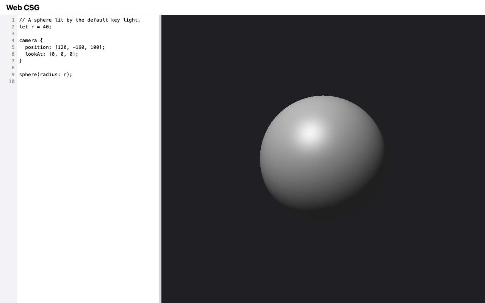

# M2 — Language & feedback: verification evidence

Change: `openspec/changes/m2-language-and-feedback` on branch
`m2-language-and-feedback`. Recorded 2026-09-10. Machine: macOS, Node v22.20.0,
npm 10.9.3, `@playwright/test` 1.63.0. Owner decisions in this change:
- the preview resizes with the window and a divider;
- the two M1 backlog items are folded in;
- D18 accepted: 12 ms render slice; divider 420/240/16 px; the nesting cap
  also counts parentheses and bodies.

## Captures

`npm run capture -- M2` (Chromium, 1280×800, device scale factor 1):

| Shot | Shows |
| --- | --- |
|  | `app.png`: the line-number gutter, the example source, and the shaded sphere in a preview that fills the rest of the window |
|  | `stale.png`: after `sphere(radius: r - 40);`, the red "Stale: showing the last valid model" badge over the last valid image, with `9:8 the radius must be greater than 0` listed under the editor |

## ROADMAP "done when" criteria

| Criterion | Evidence | Result |
| --- | --- | --- |
| Every Modeling language and Camera definition scenario for the constructs supported so far passes as a unit test | [Scenario coverage](#scenario-coverage) | Pass |
| The stale-preview, debounce, cancel, responsiveness, resize, and diagnostic-click scenarios pass as e2e tests on all three engines | `e2e/live-rebuild.spec.js`, `e2e/editor-preview.spec.js` | Pass: 57/57 Playwright tests (19 per engine) |
| Evidence: captures of a valid render and of the stale state with a visible diagnostic | `app.png`, `stale.png` above | Pass |
| Full gate from a fresh checkout | `git clone --branch m2-language-and-feedback` at `5f99ad6`, then `npm ci`, `npx playwright install`, `npm run hooks:install`, and `npm run check < /dev/null` | Pass: exit 0; `node --test` 160/160; Playwright 57/57 |
| Manual Safari smoke check | See below | Pass |
| Separate Critic review returns `[APPROVED]` | Recorded in the merge | Pending at time of writing |

## Scenario coverage

| Capability (delta spec) | Tests |
| --- | --- |
| `modeling-language`: Statements | `test/core/parser.test.js` (every statement form, missing `;`, a transform without a body, chained transforms, unclosed body, the vision example parses) |
| `modeling-language`: Expressions | `test/core/parser.test.js` (chain shapes, precedence, parentheses); `test/core/language.test.js` (precedence and associativity values, vector arithmetic, invalid operand kinds at the operator, division by zero for numbers and vectors, overflow, no cascade) |
| `modeling-language`: Empty bodies, let scope, constructs not yet supported | `test/core/language.test.js` (empty bodies at the keyword, let scoped to its block, shadowing inside a block, contents of unsupported constructs still checked, each later construct at its keyword, the vision example reports only not-supported constructs) |
| `modeling-language`: Bounded nesting | `test/core/parser.test.js` (100 and 101 levels of minus, `[`, `(`, and `union {` bodies; shared levels; pathological depth); `test/core/language.test.js` (a 100,000-term chain evaluates to 100001) |
| `modeling-language`: Lexical structure | `test/core/lexer.test.js` (unchanged M1 scenarios) |
| `camera-definition` | `test/core/language.test.js` (camera block inside a body); `test/core/camera.test.js` (the D14 parallel check with non-unit `up`, plus the M1 scenarios) |
| `editor-preview` | `e2e/editor-preview.spec.js` (initial render with canvas size equal to panel size, gutter numbers, gutter scroll sync, diagnostic click at 4:7 and after an emoji, divider drag, clamping, keyboard); `test/ui/text-position.test.js`; `test/ui/divider.test.js` |
| `live-rebuild` | `e2e/live-rebuild.spec.js`: on Playwright's fake clock, rebuild at 300 ms and not before, restart on each edit, resize re-render at 150 ms; on real time, the status and the final image equal to a full render, cancellation by a newer model, typing responsiveness, window and divider resize at the new size, vertical fov preserved. Also `test/ui/debounce.test.js` and `test/ui/render-job.test.js` (slices within the 12 ms budget, exact row coverage, cancel, output equal to a full render) |
| `stale-preview` | `e2e/live-rebuild.spec.js` (stale on error with the image checksum unchanged, cleared on fix, stays stale across a resize) |
| `verification-tooling` (core purity) | `test/core-purity.test.js` (imports and re-exports without spaces, plus the M1 fixtures) |

## Render times (core renderer in Node, 854×761, the default preview size at 1280×800)

| Scene | ms (three runs) |
| --- | --- |
| Default example | 157, 144, 139 |
| 12 concentric spheres (the e2e "heavy" scene) | 1069, 1000, 984 |

In the page this work is split into slices of at most 12 ms, so typing is
handled between slices. The responsiveness e2e test types while a render of
the heavy scene is still in progress.

## Seen to fail

| Check | Break (in a scratch worktree) | Observed |
| --- | --- | --- |
| Debounce e2e tests | `rebuildDebounceMs: 0` in `src/ui/settings.js` (at `5f99ad6`) | exit 1; `✘ … edits rebuild 300 ms after the last keystroke, and not before` and `✘ … each edit restarts the wait`; the resize test (150 ms, untouched) still passes |
| Cancellation | `cancel() {}` in `src/ui/render-job.js`, so a cancelled job keeps drawing | e2e: `✘ … a newer model cancels the render in progress`: the canvas differs from a full render in 104,658 bytes. Unit: `not ok … cancel stops further work and callbacks`, `not ok … cancel before the first slice draws nothing` |
| Purity scanner, no-space imports | New fixture test against the old patterns (at `main`) | `not ok … imports and re-exports written without spaces are reported` (actual `[]`) |

## Implementation notes

The first e2e run of the new suites exposed three test problems, all fixed
before the first commit:
- **Heavy scene:** my "heavy" scene (60 spheres) took several seconds per
  render, which timed out the cancellation test. It is now 12 spheres
  (about 1 s), with 40 for the render that must still be in progress when
  the second model arrives.
- **Idle helper:** `waitForIdle` waited for "done = started", which never
  holds after a cancellation. It now waits for the status to hide, and the
  page exposes a `rendersCancelled` counter that the test asserts.
- **Divider clamp:** the clamp test dragged the pointer 3,000 px outside the
  viewport, where Firefox delivers no pointer moves. It now drags to the
  window edges.

## Manual Safari smoke check

2026-09-10, done by the project owner in desktop Safari at
`http://127.0.0.1:8080/` (served by `npm start`). **Pass:**
- the gutter and a sphere filling the preview;
- a rebuild shortly after typing stops;
- the stale badge on `sphere(radius: r - 40);` with the picture kept, and a
  click on the `9:8` error moving the caret;
- a divider drag, and the arrow keys, re-rendering at the new size;
- no console errors.
