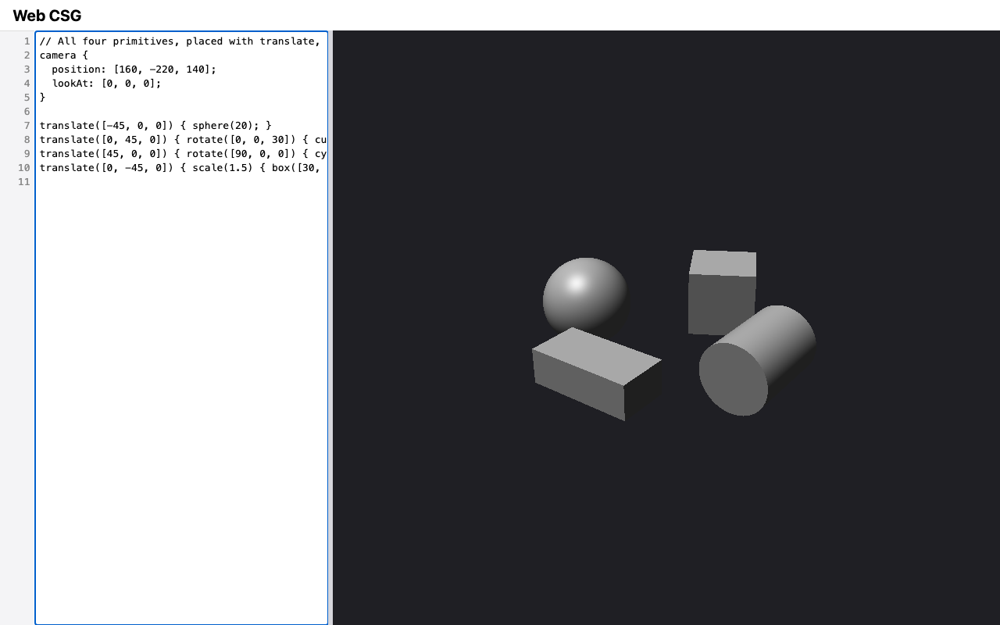

# M3 — Primitives & transforms: verification evidence

Change: `openspec/changes/m3-primitives-and-transforms` on branch
`m3-primitives-and-transforms`. Recorded 2026-09-10. Machine: macOS, Node
v22.20.0, npm 10.9.3, `@playwright/test` 1.63.0. Owner decisions in this
change:
- D19: transforms take exactly one positional argument;
- the three M2 backlog items are folded in.

## Captures

`npm run capture -- M3` (Chromium, 1280×800, device scale factor 1):

| Shot | Shows |
| --- | --- |
|  | `primitives.png`: the `arrangement` scene. A sphere on the left, a cube turned 30° about Z at the back, a cylinder rotated 90° about X to lie along Y on the right, and a box scaled 1.5× at the front, all lit by the default key light |
|  | `app.png`: the default sphere example |
|  | `stale.png`: the stale badge and the `9:8` diagnostic (unchanged M2 behavior) |

## ROADMAP "done when" criteria

| Criterion | Evidence | Result |
| --- | --- | --- |
| All Primitives, Transforms, and Implicit union scenarios pass | [Scenario coverage](#scenario-coverage) | Pass |
| Golden images exist for each primitive and for a rotated and translated arrangement | `test/golden/cube.ppm`, `box.ppm`, `cylinder.ppm`, and `arrangement.ppm` (64×48, from `test/support/scenes.js`), plus M1's `sphere.ppm` and `sphere-inside.ppm`. Each new image was inspected when created: each solid shows three distinct face shades under the key light, and the cylinder a bright cap with a shaded side | Pass |
| Evidence: a capture showing all four primitives | `primitives.png` above | Pass |
| Full gate from a fresh checkout | `git clone --branch m3-primitives-and-transforms` at `0cbd591`, then `npm ci`, `npx playwright install`, `npm run hooks:install`, and `npm run check < /dev/null` | Pass: exit 0; `node --test` 202/202; Playwright 69/69 |
| Manual Safari smoke check | See below | Pass |
| Separate Critic review returns `[APPROVED]` | Recorded in the merge | Pending at time of writing |

## Scenario coverage

| Capability (delta spec) | Tests |
| --- | --- |
| `primitives` | `test/core/primitives.test.js`: box at the origin with endpoint normals, top-down box, parallel rays, touching an edge misses, a ray in a face plane is a hit (D20), the corner tie takes the lowest axis, non-unit direction; cylinder cap hit and normals, side hit, above the cap, side tangent, parallel to the axis outside the radius, along the side line and in either cap plane is a hit (D20), a slanted ray from side to cap, the side wins an exact rim tie, non-unit direction; the sphere's general quadratic. `test/core/language.test.js`: dimension kinds and positivity for cube, box, and cylinder, missing and extra arguments. `test/core/scene.test.js`: a cube renders exactly as the equal-sided box |
| `transforms` | `test/core/transform.test.js`: exact sine and cosine; the three D4 direction scenarios plus order checks (X before Y, X before Z, Y before Z); exact 90°, 180°, and −90°; composition order; the `toLocal` round trip with an unnormalized direction; normals at unit length. `test/core/scene.test.js`: translated sphere (x = 9), `scale(2) { sphere(3); }` entering at x = −6, nested translate/rotate occupying `[9, 11] × [−2, 2] × [−1, 1]`, a translate nested inside a rotate (`[109, 111]`) or a scale (`[118, 122]`) applied first, and a rotation nested inside a rotation applied first (`[95, 105]`). `test/core/language.test.js`: exactly one positional argument (D19), argument kinds, scale > 0, and an invalid transform whose body is still checked |
| `ray-intervals` | `test/core/scene.test.js`: a scaled solid reports world distances `[90, 110]`; a rotated box's world normal `[0, −1, 0]` at y = −1, unit length; a rotated cylinder capped along its new axis; D20 in-face rays of translated solids are hits (box face `[99, 101]`, cylinder cap and side line `[95, 105]`); rays beyond `ε` miss at scale 1, 1000, and 0.001. `test/core/primitives.test.js`: in-face rays at the origin (box face, cylinder side line and both caps); the tangent ray misses (M1's `sphere` tests) |
| `implicit-union` | `test/core/scene.test.js`: several children of a transform are unioned (`[95, 105]`); the transform applies to the whole union (`[115, 130]`) |
| `modeling-language` | `test/core/language.test.js`: the vision example reports only `difference` and `union`; Booleans, `light`, and `material` rejected at the keyword with their contents checked; primitives inside an unsupported Boolean checked; cylinder positional and named equivalence; the DESIGN §8 cylinder argument errors (positional after named, duplicate `radius`, missing `height`). `test/core/parser.test.js`: argument parentheses count as a nesting level (99 pass; 100 fail at column 107) |
| `editor-preview` | `e2e/editor-preview.spec.js`: at a 400 px window the editor keeps 240 px and the preview gets the rest |
| `live-rebuild` | `e2e/live-rebuild.spec.js`: a resize during a render cancels it (`rendersCancelled` +1), one render completes at the new size, and the canvas equals a full render |

## Seen to fail

Each break was made in a scratch worktree of `0cbd591`. Each run used
`transform`, `primitives`, `scene`, `primitives-golden`, and `render-golden`:
a baseline of 33/33 passing, then one mutation at a time.

| Break | Tests that failed |
| --- | --- |
| Rotation order `Rx·Ry·Rz` instead of `Rz·Ry·Rx` (this reverses every pair; round 1 found that the Y-before-Z pair alone was not pinned, see below) | `rotation components apply X first, then Y, then Z` |
| Local direction renormalized in `toLocal` | `a scaled solid still reports world distances`, `toLocal inverts the placement and keeps the direction unnormalized` |
| No exact right-angle values | 9 tests, including `right-angle rotations are exact`, `sine and cosine are exact for multiples of 90°`, `normals of a rotated solid are in world space` |
| Normals not transformed to world space | `scene "arrangement" matches its golden image`, `normals of a rotated solid are in world space`, `a rotated cylinder is capped along its new axis`, `normals come back through the rotation only, at unit length` |
| Cylinder entry cap normal sign flipped | `cylinder is capped and aligned to local Z`, `a rotated cylinder is capped along its new axis` |

My first two attempts at this table were invalid, and I discarded them. I
passed the test files through an unquoted shell variable, and zsh does not
word-split that. Node received one argument that named no file, and exited 1
with "Could not find …" before running any test. The runs above list the
files explicitly and include a passing baseline.

## Critic round 1: `[REJECTED]`, and fixes

The Critic reviewed `a39cbc2` and ran a brute-force check: 8000 rays
through nested placements, with no mismatches. It rejected the milestone
for test gaps only. No `src` file changed in the fix.

| Finding | Fix |
| --- | --- |
| Composing a `translate` as the parent (`compose(translation(value), context.placement)`) survived: no test nested a translate inside a rotate or scale | `a translate nested inside a rotate or scale is applied first` (`scene.test.js`) |
| The rotation `Ry·Rz·Rx` survived: nothing pinned Y before Z | The Y-before-Z assertion in `rotation components apply X first, then Y, then Z`; the table above is corrected |
| tasks.md 3.3 claimed box-face tangent tests that did not exist, and DESIGN did not settle a ray lying in a face | The owner chose closed solids (DESIGN D20, with the §8 wording clarified). New tests cover rays in a box face plane, along the cylinder side line, and in either cap plane. tasks.md 3.3 now describes the real tests |
| The tie-breaks in design D-3 and tasks 3.2 were untested | The box corner tie (lowest axis, in and out), and an exact rim tie at entry (direction `[1, 0, 1]` from `[-10, 0, -10]`, both bounds at t = 5 exactly) that gives the side normal. Round 2 found that the exit rim tie was still untested |
| Informational: the DESIGN §8 cylinder argument examples were untested | `cylinder argument errors (DESIGN §8 examples)` (`language.test.js`) |

Seen to fail, in a scratch worktree of `a39cbc2` with the four updated test
files copied in. Each run lists its test files explicitly. The baseline was
56/56 passing across `primitives`, `transform`, `scene`, and `language`.
Each mutation was reverted with `git checkout` before the next.

| Mutant | Files run | Failed |
| --- | --- | --- |
| F: `compose(translation(value), context.placement)` in `evaluate.js` | `scene` | 1/10: `a translate nested inside a rotate or scale is applied first` |
| G: `Ry·Rz·Rx` in `rotation` | `transform` | 1/8: `rotation components apply X first, then Y, then Z` |
| H: box ties go to the highest axis (`>=`, `<=`) | `primitives` | 1/14: `box: a slab tie (a corner hit) takes its normals from the lowest axis` |
| I: the cylinder cap wins a tie (`sideIn > capIn`) | `primitives` | 1/14: `cylinder: the side wins an exact tie with a cap (a rim hit)` |
| J: open box slabs (`o <= -half \|\| o >= half`) | `primitives` | 1/14: `box: a ray lying in a face plane is a hit (closed solids, D20)` |
| K: open cylinder side (`>= radius²` when parallel to the axis) | `primitives` | 1/14: `cylinder: a ray along the side line or in a cap plane is a hit (closed solids, D20)` |
| L: open cylinder caps (`oz <= -half \|\| oz >= half`) | `primitives` | 1/14: the same cylinder D20 test |

Gate after the fixes: `npm run check < /dev/null` in the working tree exits
0, with `node --test` at 208/208 and Playwright at 69/69.

## Critic round 2: `[REJECTED]`, and fixes

The Critic reviewed `21cdee4`. It confirmed every round 1 fix, and 15 of its
own extra mutants were caught. It ran the gates, including a fresh clone at
`21cdee4`: 208/208 and 69/69.

| Finding | Fix |
| --- | --- |
| Medium: D20 failed for translated solids. In `translate([0, 0.3, 0]) { box([2, 0.2, 2]); }` the face is at world y = 0.4, but its local offset is `0.10000000000000003`, so an in-face ray missed. The same happened with a translated cylinder cap | The owner chose an `ε` tolerance (DESIGN D20 amended). `box.js` and `cylinder.js` allow `ε` in world units, which is `ε·\|d\|` locally, in the parallel-ray checks. New scene tests: translated box face, cylinder cap, and cylinder side line are hits; rays `1e-5` beyond miss; at scale 1000 and 0.001, `5e-7` beyond is a hit and `2e-6` beyond a miss |
| Medium: D20 was missing from the delta specs | The `ray-intervals` delta now has a MODIFIED "Closed intervals with normals and the ε length rule", with the M1 tangent scenario kept and scenarios for box faces, the cylinder side line and caps, translated solids, and rays beyond `ε` |
| Low: the exit rim tie was untested (mutant `sideOut < capOut` survived) | A second assertion in the rim-tie test: from the center along `[1, 0, 1]`, the exit at t = 5 has the side normal `[1, 0, 0]` |
| Informational: the fresh-checkout row was for `0cbd591`; stale Purpose lines in the main `primitives` and `implicit-union` specs; ROADMAP backlog and task 7.2 | The fresh clone is re-run at the new head (above). The Purpose lines are refreshed at archive. ROADMAP and 7.2 are closed before the merge |

Seen to fail, in a scratch worktree of `21cdee4`. Each run lists
`scene.test.js` and `primitives.test.js` (26 tests). The baseline, with
the new `src` and the new tests, was 64/64 across `scene`, `primitives`,
`transform`, `language`, `primitives-golden`, and `render-golden`.

| Mutant | Failed |
| --- | --- |
| M: the reviewed `src` at `21cdee4`, with the new tests | 2/26: `D20 holds for placed solids…`, `the D20 tolerance is ε in world units…` |
| N1 and N2: the tolerance is `ε` in local units (box; cylinder) | 1/26 each: `the D20 tolerance is ε in world units…` |
| O1 and O2: the tolerance is scaled the wrong way, `ε / \|d\|` (box; cylinder) | 1/26 each: the same test |
| P1: open box faces (shrunk by the tolerance) | 3/26: the box in-face test at the origin, and both D20 scene tests |
| P2: open cylinder caps | 3/26: the cylinder in-face test at the origin, and both D20 scene tests |
| P3: open cylinder side line | 2/26: the cylinder in-face test at the origin, and `D20 holds for placed solids…` |
| Q1: no tolerance on the cylinder side only | 1/26: `D20 holds for placed solids…` |
| Q2: no tolerance on the cylinder caps only | 2/26: both D20 scene tests |
| R: the tolerance is 100 times too large | 1/26: `the D20 tolerance is ε in world units…` |
| I2: the cap wins the exit rim tie (`sideOut < capOut`) | 1/26: `cylinder: the side wins an exact tie with a cap (a rim hit)` |

Gate after the round 2 fixes: `npm run check < /dev/null` in the working tree
exits 0, with `node --test` at 210/210 and Playwright at 69/69.
`openspec validate m3-primitives-and-transforms --strict` is valid.

## Critic round 3: `[REJECTED]`, and fixes

The Critic reviewed `ad4bdaa` and confirmed the round 2 fixes for translated
and scaled solids: the tolerance is correctly derived, and its own mutants
were caught. The gates passed in its fresh clone (210/210 and 69/69).

| Finding | Fix |
| --- | --- |
| Medium: in-face rays of solids rotated by angles that are not multiples of 90° still miss. The tolerance applies only when a local direction component is exactly 0, and such a rotation leaves a residue of about `1e-16`. The Critic's pins: a ray in a face of `rotate([0, 0, 45]) { box([2, 2, 2]); }`, along the side line of `rotate([10, 0, 0]) { cylinder(5, 10); }`, and in the cap of `rotate([0, 10, 0]) { cylinder(5, 10); }`. Its sweep found 1 in 21 box rays and 2 in 28 cylinder rays missing. It could not reproduce the miss in a render | The owner narrowed D20 (DESIGN §12, §8). The guarantee covers `translate`, `scale`, and right-angle rotations, which are exact per D4 and D7. Under other rotations, a ray exactly in a face is a boundary case decided by rounding. The `ray-intervals` delta spec and design D-3 say the same. A ROADMAP backlog line revisits this when `ε` is finalized in M4. The Critic's three pins document that limitation; they are not added as tests |
| Informational: the fresh-checkout row, open tasks, the M2 backlog lines, and stale Purpose lines | Closed in the approval commit and the archive |

New tests in `test/core/scene.test.js`:
- **Right angles:** an in-face ray of `translate([0.3, 0, 0]) { rotate([0, 0, 90]) { box([2, 0.2, 2]); } }` is a hit (`[99, 101]`).
- **Other rotations:** a box turned 45° about Z, and a cylinder's side line and top cap turned 10° about X. For each, a ray `1e-5` inside the face is a hit and a ray `1e-5` outside it misses.

Seen to fail, in a scratch worktree of `ad4bdaa` with the new
`scene.test.js` copied in. Each run used `scene` and `primitives`, with a
baseline of 28/28.

| Mutant | Failed |
| --- | --- |
| S: no tolerance in `box.js` | 3/28, including the new `D20 holds under right-angle rotations…` |
| T: the box tolerance is 1e5 times too large | 3/28, including the new `under other rotations, rays clearly inside or outside a face behave normally…` |
| U: no tolerance on the cylinder caps | 2/28: the two round 2 D20 scene tests |

Gate after the round 3 fixes: `npm run check < /dev/null` in the working tree
exits 0, with `node --test` at 212/212 and Playwright at 69/69.
`openspec validate m3-primitives-and-transforms --strict` is valid.

## Critic round 4: `[REJECTED]`, and fixes

The Critic reviewed `da20cf8`. It found the narrowed D20 consistent across
DESIGN, the delta spec, design D-3, this README, and ROADMAP. An
independent sweep found no failures: 19,824 in-face and near-face cases
over random chains of translate, scale, and right-angle rotations. All nine
MODIFIED blocks keep their main-spec scenarios. The gates passed in its
fresh clone (212/212 and 69/69). It rejected the milestone for two test gaps
only.

| Finding | Fix |
| --- | --- |
| Medium: no test nests a rotation inside a rotation. `compose` with `child.R · parent.R` passed 212/212, although its sweep failed 6,179 cases | `a rotation nested inside a rotation is applied first`: `rotate([0, 0, 90]) { rotate([90, 0, 0]) { cylinder(1, 10); } }` lies along X (`[95, 105]`); the other order leaves it along Y (`[99, 101]`) |
| Low: the bottom-cap tolerance was untested. Mutant U removed both caps' tolerance at once, which hid this | The D20 scene test now includes the bottom cap of `translate([0, 0, -0.3]) { cylinder(5, 0.2); }` at world z = −0.4 (`[95, 105]`) |
| Informational: the evaluator's `context.rendered` flag cannot be observed today, because any Boolean in the source already produces a diagnostic, so there is no scene | No change. It matters when M4 renders Booleans, and M4's tests will cover it |

Seen to fail, in a scratch worktree of `da20cf8` with the new
`scene.test.js` copied in. Each run used `scene`, `primitives`, and
`transform`, with a baseline of 37/37.

| Mutant | Failed |
| --- | --- |
| V: `compose` multiplies `child.R · parent.R` | 1/37: `a rotation nested inside a rotation is applied first` |
| W: no tolerance on the bottom cap only (`oz < -half`) | 1/37: `D20 holds for placed solids: in-face rays of translated solids are hits` |

Gate after the round 4 fixes: `npm run check < /dev/null` in the working tree
exits 0, with `node --test` at 213/213 and Playwright at 69/69.

## Critic round 5: `[REJECTED]`, and fixes

The Critic reviewed `7995ba5` and confirmed mutants V and W fail. Its
independent sweep compared the renderer against its own general 4×4
matrices, over 600 random chains of translate, arbitrary rotations, and
scale on all four primitives (24,000 rays). All 9,764 hits matched in `t` and
normals. Every delta-spec scenario maps to a test. The gates passed (213/213
and 69/69). It rejected for test gaps only.

| Finding | Fix |
| --- | --- |
| Medium: deleting `leave()` in `argumentList()` (`src/core/parser.js:124`, task 4.3) passed 213/213. The depth would then build up across calls, so 101 sequential `sphere(1);` report "nested too deeply" | `argument parentheses count as a nesting level` now also checks that 101 sequential `sphere(1);` and 60 sequential `translate([1, 0, 0]) { sphere(1); }` compile without diagnostics |
| Low: the `ε` length drop was untested for boxes and cylinders. Only zero-length touches were covered, so `> 0` in place of `> EPSILON` survived | Chords across a box corner and across the cylinder rim: one of length 4.2e-7 (≤ ε) is dropped, and one of length 4.2e-6 is kept |
| Informational: design D-7 named `transform.test.js` for the scaled-`t` and rotated-normal tests | D-7 now names `scene.test.js` |
| Informational: the first union test (`sphere(5); cube(8);`, `[95, 105]`) cannot tell the union from the sphere alone | The same test adds `sphere(5); box([4, 4, 20]);` in a transform body. The union gives `[95, 105]` along X and `[90, 110]` along Z, which neither child gives alone. The delta-spec scenario is unchanged |

Seen to fail, in a scratch worktree of `7995ba5` with the new `parser`,
`primitives`, and `scene` tests copied in. Each run used those three plus
`language`, with a baseline of 72/72.

| Mutant | Failed |
| --- | --- |
| X1: `box.js` drops only zero-length intervals (`> 0`) | 1/72: `box: a chord of length ≤ ε across a corner is dropped; a longer one is kept` |
| X2: `cylinder.js` drops only zero-length intervals | 1/72: `cylinder: a chord of length ≤ ε across the rim is dropped; a longer one is kept` |
| X3: `leave()` deleted from `argumentList()` (line 124) | 1/72: `argument parentheses count as a nesting level` |
| Y: a transform body renders only its first child | 1/72: `several children of a transform block are unioned` |

Gate after the round 5 fixes: `npm run check < /dev/null` in the working tree
exits 0, with `node --test` at 215/215 and Playwright at 69/69.

## Implementation notes

- **Scene tests:** they live in a new `test/core/scene.test.js`, and the new
  goldens in `test/core/primitives-golden.test.js`. tasks.md 4.4 and 5.1 were
  updated to name these files.
- **M1 sphere goldens:** they still pass under the general quadratic.

## Manual Safari smoke check

2026-09-10, done by the project owner in desktop Safari at
`http://127.0.0.1:8080/` (served by `npm start`). **Pass:**
- pasting the arrangement source shows all four primitives, placed, rotated,
  scaled, and lit as described;
- no console errors.
