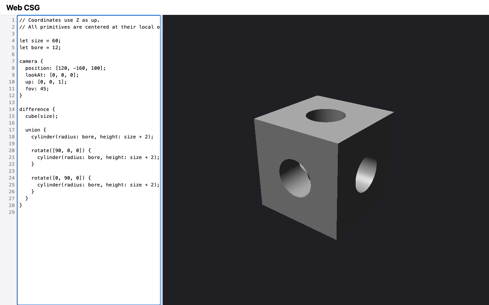
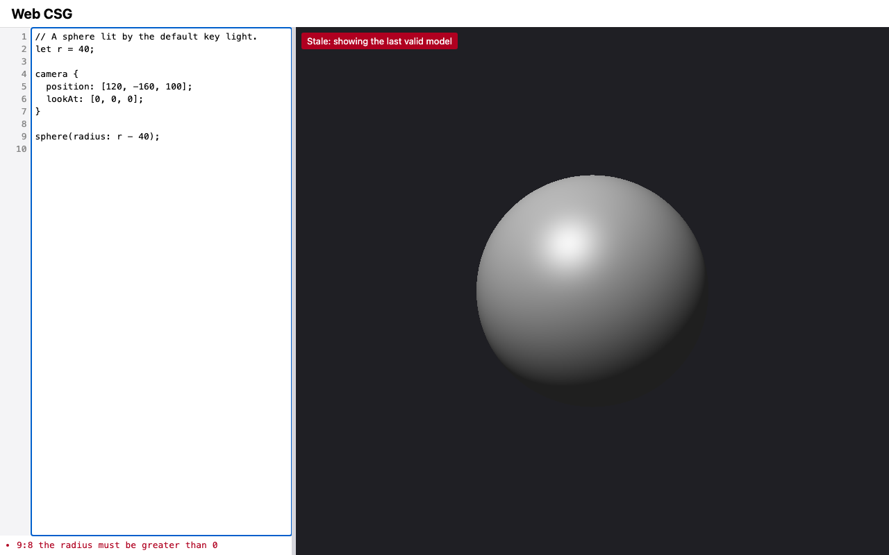

# M4 — CSG: verification evidence

Change: `openspec/changes/m4-csg` on branch `m4-csg`. Recorded 2026-09-10.
Machine: macOS, Node v22.20.0, npm 10.9.3, `@playwright/test` 1.63.0.

Owner decisions in this change:
- **D16:** best effort outside the supported scale. There is no range check,
  non-finite values stay errors, and an overflowing camera distance gets a
  clear diagnostic.
- **Scale range:** keep DESIGN's ×1e-3 and ×1e5 scaled-render scenario. If
  it passes, widen the range to what it exercises, `[1e-3, 2e7]`.
- **D20:** keep the narrowed rule, and close its backlog line.
- **Backlog:** fold in the mixed-type top-level union test.

## Captures

`npm run capture -- M4` (Chromium, 1280×800, device scale factor 1):

| Shot | Shows |
| --- | --- |
|  | `bored-cube.png`: the `vision.md` example in the editor, with no diagnostics and no stale badge. The preview shows a cube of size 60 bored through by three orthogonal cylinders of radius 12. The holes open on the top, front, and right faces, and the bore walls are lit by the key light |
|  | `primitives.png`: the M3 `arrangement` scene, unchanged |
|  | `app.png`: the default sphere example. The bored cube becomes the first-launch default in M6 |
|  | `stale.png`: the stale badge and diagnostic (unchanged M2 behavior) |

## ROADMAP "done when" criteria

| Criterion | Evidence | Result |
| --- | --- | --- |
| All Boolean operations and Ray–solid intervals and tolerance scenarios pass, including `difference { A; A; }` being empty | [Scenario coverage](#scenario-coverage) | Pass |
| The scaled-render scenario passes at ×1e-3 and ×1e5; `ε` and the scale range marked final in DESIGN §5, or revised with the measured reason | [Scaled render](#scaled-render-measurement): byte-identical renders. DESIGN §5 marks `ε = 1e-6` final and revises the range to `[1e-3, 2e7]`, with the reason in §12 D7 | Pass |
| The bored-cube golden image is committed and passing | `test/golden/bored-cube.ppm` (64×48), in `test/core/csg-golden.test.js`. This is the core-render "callable without a browser" scenario | Pass |
| Evidence: a capture of the bored cube | `bored-cube.png` above | Pass |
| Full gate in the working tree | `npm run check < /dev/null` on the final tree (after the `booleans` camera change) | Pass: exit 0; `node --test` 244/244; Playwright 69/69 |
| Full gate from a fresh checkout | Pending at time of writing | Pending |
| Manual Safari smoke check | Pending (owner) | Pending |
| Separate Critic review returns `[APPROVED]` | Pending | Pending |

## Scenario coverage

| Capability (delta spec) | Tests |
| --- | --- |
| `boolean-operations` | `test/core/boolean.test.js` covers the union block (`[95, 113]`), a transformed intersection (`[116, 124]`), the intersection (`[96, 104]`), a disjoint intersection, the multi-child difference (`[90, 93]`, `[97, 103]`, `[107, 110]`), self-difference of a sphere and a cube (no intervals, background pixels), the single-child difference, and reversed cutter normals (`[0, 0, -1]` at 97, `[0, 0, 1]` at 103). `test/core/intervals.test.js` covers the DESIGN "Interval combination along a ray" (`[2, 8]`, `[4, 6]`, and `[2, 4]` with `[6, 8]`) |
| `ray-intervals` | `test/core/boolean.test.js` covers the flush union (`[95, 115]`), the flush difference (no hit), a near-flush difference (a 5e-7 sliver dropped, a 5e-6 one kept), and a bore wall seen from inside (t = 3, normal `[-1, 0, 0]`, not flipped again). `test/core/scaled-render.test.js` covers the scaled renders. `test/core/intervals.test.js` covers the tie rules and sliver drops for `intersect` and `subtract` |
| `implicit-union` | `test/core/scene.test.js`: several top-level solids of different types (`[95, 105]` along X, `[90, 110]` along Z) |
| `modeling-language` | `test/core/language.test.js` covers: the vision example has no diagnostics, and its tree is a cube minus the union of three cylinders; `light` and `material` are rejected at their keyword (line 5, column 1) and their contents are still checked; errors inside a Boolean carry no "not supported" diagnostic; `union { }` is still an empty-body error |
| `core-render` | `test/core/csg-golden.test.js`: the bored cube has no diagnostics, a 64 × 48 × 4 buffer, and matches the `bored-cube` golden |
| `camera-definition` | `test/core/camera.test.js`: a 1e200 camera reports only "position and lookAt are too far apart" at `lookAt`, and `position: [16000000, 0, 0]` is accepted |

## Scaled-render measurement

The bored cube was rendered at 64×48, with every coordinate and dimension
multiplied by `k`: `size`, `bore`, the `+ 2` height margin, and the camera
position. The helper is `scaledBoredCube` in
`test/core/scaled-render.test.js`. Its ×1 source renders byte-identical to
the vision example.

| Factor | Largest channel difference | Channels differing |
| --- | --- | --- |
| ×0.001 | 0 | 0 of 12,288 |
| ×100000 | 0 | 0 of 12,288 |

Both scaled renders are byte-identical to the unscaled one. The ×1e-3 render's
smallest magnitude is the 0.001 overhang; the ×1e5 render's largest is the
camera coordinate at 1.6e7. DESIGN §5 now states `ε = 1e-6` (final) and the
supported scale `[1e-3, 2e7]` (final), and §12 D7 records the measurement.

## Goldens

Each image was inspected when created. I converted each to PNG and viewed
it; the `booleans` scene was also viewed at 256×192.
- **`bored-cube`:** the cube with holes on three faces and lit bore walls.
- **`booleans`:** a union (a sphere bulging from a cube), an intersection (a
  cube with rounded edges), and a difference (a cube with spherical holes in
  its faces).
  - The first version used the M3 camera distance, where the solids were only
    a few pixels across.
  - I moved the camera closer to `[70, -150, 80]` and regenerated the
    golden, before any commit.
- **Earlier goldens:** all M1 and M3 goldens pass unchanged.

## Seen to fail

Each break was made in a scratch copy of the working tree, before the first
M4 commit. Each run listed nine files explicitly: `intervals`, `boolean`,
`scene`, `camera`, `language`, `csg-golden`, `render-golden`,
`primitives-golden`, and `scaled-render`. The baseline was 98/98 passing, and
each file was restored after its run.

| Break | Tests that failed |
| --- | --- |
| N1: `subtract` does not reverse cutter normals | 3/98: `difference boundaries shade with reversed cutter normals`, `a bore wall seen from inside the bore…`, `interval combination along a ray…` |
| N2: a cutter reaching into the next base interval is skipped for it | 1/98: `several base intervals and cutters, including one cutter spanning two base intervals` |
| N3: `intersect` lets `b` win exact ties | 1/98: `intersect keeps the first operand's endpoint on an exact tie` |
| N4: `difference` is evaluated as a union of all children | 8/98, including `multi-child difference…`, `self-difference is empty…`, `a flush difference opens the face`, and both M4 goldens |
| N5: no `ε` drop after `subtract` (`> 0`) | 1/98: `subtract and intersect drop slivers of length ≤ ε and keep longer pieces` |
| N6: no finite-distance camera check | 1/98: `a camera too far away is reported as such…` |

Notes:
- **Tie mutant replaced:** tasks.md 7.1 listed "`subtract` letting the base
  win ties". That mutant is equivalent to the real code. At an exact tie the
  base's remaining piece has zero length, and the `ε` drop removes it either
  way. It was replaced by N2, which exercises the same sweep bookkeeping.
- **N5 is caught at interval level only:** in a scene, the root union
  applies its own `ε` drop. So the 5e-7 sliver still disappears at scene
  level under N5, and only the interval-level test fails.

## Implementation notes

- **Scene tree:** the scene is now `{ camera, root }`. The M3 tests that
  inspected `scene.solids` read `scene.root` instead.
- **Evaluator:** `context.rendered` is gone, because no solid construct is
  left unrendered. This resolves the M3 Critic's informational note.
- **D20:** the narrowed rule stays, and its backlog line is closed (owner).

## Manual Safari smoke check

Pending: performed by the project owner.
