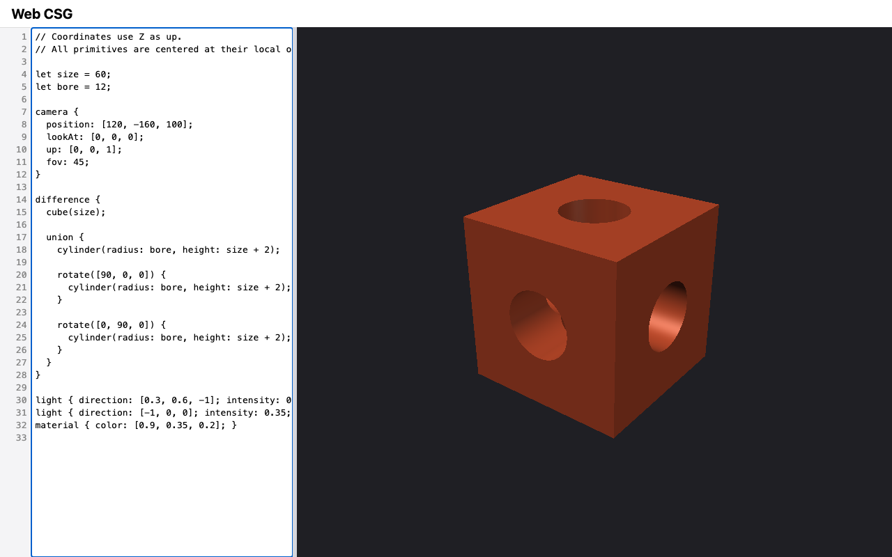

# M5 — Lighting & material: verification evidence

Change: `openspec/changes/m5-lighting-and-material` on branch
`m5-lighting-and-material`. Recorded 2026-09-11. Machine: macOS, Node
v22.20.0, npm 10.9.3, `@playwright/test` 1.63.0.

Owner decisions in this change:
- **Backlog items folded in:**
  - a clear message for an `up` whose components underflow ("up is too
    small");
  - the CLAUDE.md e2e path.
- **New backlog lines** (owner requests; not in M5): Tab indents in the
  editor, on-request help for the modeling language, and point lights.

The writer's defaults, where DESIGN is silent, are recorded as DESIGN §12
D22 for the owner's review:
- `direction` and `color` are required;
- the fifth `light` and the second `material` are reported at their keyword;
- a `light` or `material` inside a body is an error, and does not count
  toward the limits.

## Captures

`npm run capture -- M5` (Chromium, 1280×800, device scale factor 1):

| Shot | Shows |
| --- | --- |
|  | `lit-custom.png`: the bored cube with two declared lights and `material { color: [0.9, 0.35, 0.2]; }`. The model is a warm orange; the top is brightest, the front medium, and the right face lit only by the dim second light |
|  | `bored-cube.png`: the same model under the default key light and the default grey. With `lit-custom.png`, this is the "same model under two lighting setups" |
|  | `primitives.png`: the M3 `arrangement` scene, unchanged |
|  | `app.png`: the default sphere example |
|  | `stale.png`: the stale badge and diagnostic (unchanged M2 behavior) |

## ROADMAP "done when" criteria

| Criterion | Evidence | Result |
| --- | --- | --- |
| All Lighting and shading scenarios pass | [Scenario coverage](#scenario-coverage) | Pass |
| Goldens cover the default light, a declared light, two lights, and a non-default material color | Default light: `sphere` and `bored-cube` (M1, M4). Declared: `lit-one`. Two lights: `lit-two`. Material: `lit-material`. All three new goldens are 64×48, on the bored cube, in `test/core/lighting-golden.test.js` | Pass |
| Evidence: captures of the same model under two lighting setups | `bored-cube.png` and `lit-custom.png` above | Pass |
| Full gate in the working tree | `npm run check < /dev/null` on the final tree, after the strengthened material test | Pass: exit 0; `node --test` 269/269; Playwright 69/69 |
| Full gate from a fresh checkout | Pending at time of writing | Pending |
| Manual Safari smoke check | See below | Pass |
| Separate Critic review returns `[APPROVED]` | Pending | Pending |

## Scenario coverage

| Capability (delta spec) | Tests |
| --- | --- |
| `lighting-and-shading`: Declared lights | `test/core/lighting.test.js`: <ul><li>declared lights replace the default: the 1×1 center pixel is `[31, 31, 31, 255]`, and the key light would have lit it;</li><li>the direction is the direction light travels: `toLight` is `[0, 0, 1]`, the topmost sphere pixel is lit, and the bottommost is only ambient;</li><li>intensity 0 leaves every solid pixel at `[31, 31, 31, 255]`;</li><li>two lights at 0.5 equal one at 1, within 1 per channel.</li></ul> |
| `lighting-and-shading`: Light validation | `test/core/lighting.test.js` covers every table row: missing, zero, too large, and too small directions; a negative intensity; unknown, duplicate, and mistyped properties; four lights allowed, and a fifth reported at its keyword with its contents still checked; a light inside a body, checked and not counted toward the limit (the misplaced light comes first) |
| `lighting-and-shading`: Material color | `test/core/lighting.test.js`: with `[1, 0, 0]`, green equals blue in every solid pixel, the white highlight shows, and lit pixels are red. Where `N`, `V`, and `L` coincide, the color is `[1, 0.3, 0.3]`. A valid material sets `scene.color` |
| `lighting-and-shading`: Material validation | `test/core/lighting.test.js` covers every table row: a second block, components above 1 and below 0, a missing color, unknown and mistyped properties, and a material inside a body (still checked) |
| `lighting-and-shading`: Default key light and Default model color (MODIFIED) | `test/core/lighting.test.js`: with no light block, `scene.lights` is empty and the center pixel equals the key-light shading. Without a material, `scene.color` is `[0.8, 0.8, 0.8]`. The existing `test/core/shade.test.js` covers the key-light direction and the unlit default color |
| `modeling-language` (REMOVED "not supported yet") | `test/core/language.test.js`: errors inside `light` and `material` blocks are reported with no "not supported" diagnostic, and valid blocks produce no diagnostics |
| `camera-definition`: Camera math stays finite (MODIFIED) | `test/core/camera.test.js`: an underflowing `up` reports only "up is too small" at `up`. The M4 overflow and distance tests still pass, as do all camera message tests after the refactor onto the shared property reader |

## Goldens

Each image was inspected at 256×192 and at its 64×48 size.
- **`lit-one`:** one light from the front left above. The front and top
  faces are lit, the right face is dark, and the bore walls are shaded.
- **`lit-two`:**
  - The first version used lights that lit the top, front, and right faces
    almost equally, giving a flat grey that did not show the second light.
  - Before any commit, I changed it to a key light from above the front and
    a dim light travelling toward −X, and regenerated it.
  - Now the top is bright, the front medium, and the right face lit only by
    the second light.
- **`lit-material`:** the warm color `[0.9, 0.35, 0.2]` under the default
  key light.
- **Earlier goldens:** all M1, M3, and M4 goldens pass unchanged.

## Seen to fail

Each break was made in a scratch copy of the working tree, before the first
M5 commit. Each run listed six files explicitly: `lighting`,
`lighting-golden`, `camera`, `language`, `render-golden`, and `csg-golden`.
The baseline was 66/66 passing, and each file was restored after its run.

| Break | Tests that failed |
| --- | --- |
| L1: declared lights ignored (always the key light) | 4/66: `lit-one` and `lit-two` goldens, `declared lights replace the default key light`, `intensity 0 leaves only the ambient term…` |
| L2: `toLight` not negated | 3/66: `lit-one` and `lit-two` goldens, `a light's direction is the direction light travels…` |
| L3: intensity ignored | 3/66: the `lit-two` golden, `intensity 0…`, `several lights add their contributions…` |
| L4: material color ignored | 1/66: the `lit-material` golden. After this run I strengthened `material color…` to require red lit pixels. A rerun of L4 against `lighting.test.js` alone then failed it (1/15, from a 15/15 baseline), so the analytic test guards this too |
| L5: a fifth light accepted | 1/66: `four lights are allowed; a fifth is reported…` |
| L6: a misplaced light counted | 1/66: `a light inside a body is an error…`. I reordered that test so the misplaced light comes first; in the original order, this mutant could not change the result |
| L7: the underflow check removed | 2/66: `an up vector too small to measure…` and `light validation: a missing, zero, too large, or too small direction` |
| L8: the shared reader uses a fixed keyword in its messages | 2/66: `light validation: unknown, duplicate, and mistyped properties…` and `material validation…` |

## Implementation notes

- **`src/core/properties.js`:** the shared property-block reader, the
  missing-property message, and `lengthProblem`. It is used by `camera.js`,
  whose messages and columns are unchanged, and by the new `lighting.js`.
- **The scene:** it gains `lights`, in world space, and `color`.
  `render.js` uses the declared lights, or the key light when there are
  none, and the scene color. `shade.js` is unchanged.

## Manual Safari smoke check

Done on 2026-09-11 by the project owner, in desktop Safari at
`http://127.0.0.1:8080/` (served by `npm start`). **Pass:**
- The owner pasted the bored cube with two declared lights and
  `material { color: [0.9, 0.35, 0.2]; }`. It renders orange, with the top
  brightest, the front medium, and the right face dimmer but lit.
- There were no diagnostics and no console errors.
- Changing one intensity to `-1` shows "intensity must be at least 0", and
  the preview keeps the last valid image, marked stale.
