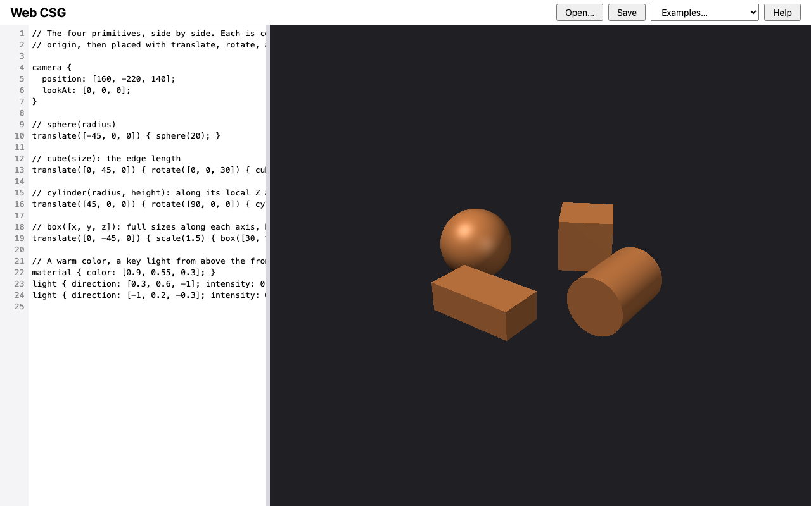
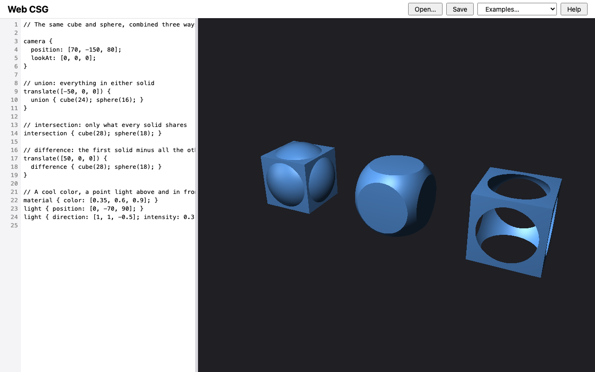
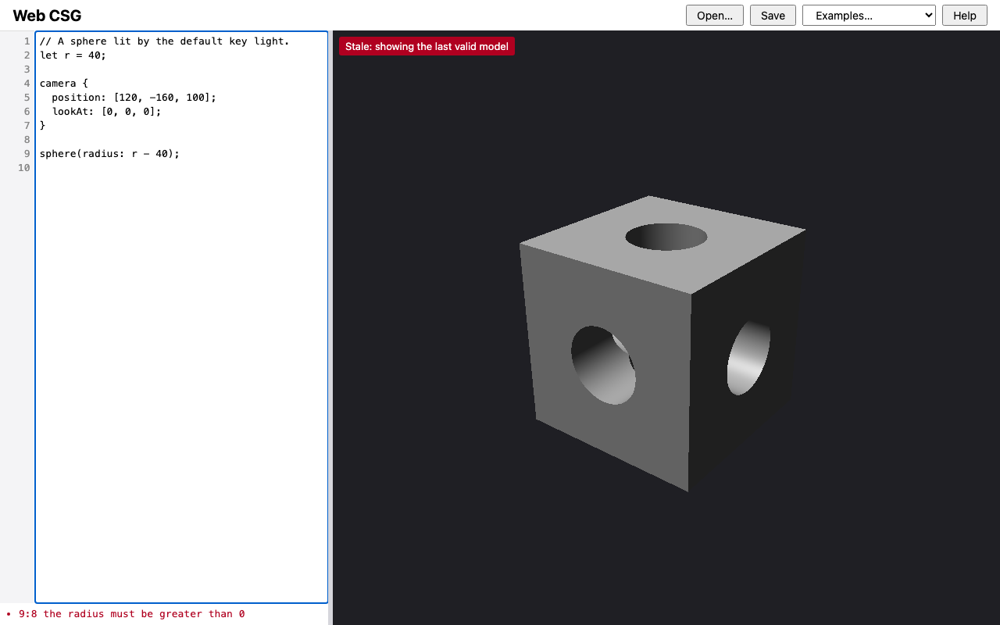

# M6 — Persistence & examples: verification evidence

Change: `openspec/changes/m6-persistence-and-examples` on branch
`m6-persistence-and-examples`. It delivers ROADMAP milestone **M6**, the
first release. Recorded 2026-09-11. Machine: macOS, Node v22.20.0, npm
10.9.3, `@playwright/test` 1.63.0.

Decisions (DESIGN §12):
- **D17 (the owner, in the D17 interview before M6):**
  - identifiers and whitespace stay ASCII;
  - one leading byte-order mark is skipped;
  - an unexpected character's diagnostic names it, for example
    `'é' (U+00E9)` or `U+00A0 (no-break space)`.
- **D26:** the owner chose the header toolbar and the browser's native
  `confirm()`. The writer's defaults (a)–(e), pending the owner's
  acceptance:
  - the save file name;
  - the saved baseline;
  - Open asks only after a file is chosen;
  - a load rebuilds at once;
  - no autosave without storage.
- **D27 (the owner, during apply):** the stale indicator stays hidden while
  no valid model exists yet.

## ROADMAP "done when"

| Criterion | Evidence | Result |
| --- | --- | --- |
| All Save, load, and examples scenarios pass as e2e tests on all three engines | `e2e/persistence.spec.js` (20 tests) and `e2e/editor-preview.spec.js` on Chromium, Firefox, and WebKit; see [Test coverage](#test-coverage) | Pass |
| Every built-in example evaluates with no diagnostics and has a golden image | `test/ui/examples.test.js`: the goldens `example-bored-cube`, `example-primitives`, and `example-boolean-operations` (64×48), reviewed as images | Pass |
| A full manual pass of DESIGN §8 in Safari is recorded | [Manual Safari pass](#manual-safari-pass-of-design-8) | Pending |
| Evidence: captures of each built-in example | [Captures](#captures) | Pending |

## Captures

`npm run capture -- M6` (Chromium, 1280×800, device scale factor 1). Each
shot starts in a fresh page, so it is a first launch.

| Shot | Shows |
| --- | --- |
|  | `app.png`: the first launch. The bored cube is in the editor and rendered, and the header toolbar holds Open…, Save, the Examples… picker, and Help |
|  | `example-primitives.png`: the Primitives example, chosen with the picker. It shows the sphere, the rotated cube, the box scaled by 1.5, and the cylinder turned to lie along Y, in the warm material, with a key light and a dim fill. The comments name each primitive's parameters |
|  | `example-boolean-operations.png`: the Boolean operations example. From left to right, the same cube and sphere form a union, an intersection, and a difference, in the cool material. The point light above and in front puts a highlight inside the difference |
|  | `example-bored-cube.png`: the Bored cube example, chosen with the picker. It is identical to the first launch |
|  | `stale.png`: the sphere source made invalid. The last valid model, now the first-launch bored cube, stays visible, with the stale mark and the `9:8` diagnostic |
| `primitives.png`, `bored-cube.png`, `lit-custom.png`, `lit-point.png`, `help.png`, `indented.png` | The earlier shots. Their renders are unchanged, and the header now has the toolbar |

## Gates

| Gate | Result |
| --- | --- |
| `npm run check < /dev/null` in the working tree | Before the first commit: exit 0 in 70 s, `node --test` 321/321, Playwright 171/171 |
| `openspec validate m6-persistence-and-examples --strict` | Valid |
| Every existing golden unchanged | `npm test` before any golden update: only the three new example goldens were missing |
| Full gate from a fresh checkout | Pending |
| Manual Safari pass of DESIGN §8 | Pending |
| Separate Critic review returns `[APPROVED]` | Pending |

### e2e run time (design risks, task 5.5)

| Tree | Playwright tests | Time |
| --- | --- | --- |
| `main` (`a2e4731`, the `point-lights` archive) | 108 | 58.7 s |
| This branch | 171 | 1.2 m in the gate (the whole gate took 70 s); the first full e2e run took 83 s |

The 63 new tests are 20 in `persistence.spec.js` and 1 in
`editor-preview.spec.js`, on three engines. The first launch now renders the
bored cube instead of the small M1 sphere.

## Test coverage

| Scenario (delta spec) | Tests |
| --- | --- |
| **`save-load-and-examples`** | |
| Current source is autosaved and restored on reload | `persistence.spec.js`: restored exactly, and rendered to the same image; a reload straight after typing keeps the edit |
| An invalid source is restored with its diagnostics | `persistence.spec.js`: the exact text and `9:8 the radius must be greater than 0` |
| The app works without storage | `persistence.spec.js`: an init script makes the `localStorage` getter throw, and the test checks that it is blocked. The bored cube shows, an edit rebuilds, and no page error occurs. `test/ui/persistence.test.js`: a throwing `getStorage`, a full storage, and an unreadable one |
| First launch shows the bored cube | `persistence.spec.js`, and `editor-preview.spec.js` "the example renders on load" |
| Save downloads exactly the editor text | `persistence.spec.js`: the downloaded bytes equal the editor text as UTF-8, for a valid source, an invalid one with a tab, non-ASCII, and trailing spaces, and empty text |
| The save file name | `persistence.spec.js`: `model.csg`, then `primitives.csg`, then `part.csg`. `persistence.test.js`: `saveFileName` |
| Saved text replaces without a prompt | `persistence.spec.js` |
| Open loads a .csg file | `persistence.spec.js`, through the Open button's file chooser: the text, no diagnostics, and the render; then an invalid file with its diagnostic |
| A file with a byte-order mark opens cleanly | `persistence.spec.js`: no diagnostics, and the text after any mark is the file's text. The test records what the editor holds: on Chromium, Firefox, and WebKit, `File.text()` removed the mark, so the editor has no BOM. The lexer rule (D17) covers pasted text |
| Cancelling the file chooser changes nothing | `persistence.spec.js`: the chooser is given no file; the text and the rebuild count are unchanged, with no prompt |
| Built-in examples | `persistence.spec.js`: exactly the three options after the disabled "Examples…" prompt, and each loads with no diagnostics. `examples.test.js`: ids, titles, file names, the four primitives and three operations, and the bored cube equal to the `vision.md` block |
| The picker resets after a choice | `persistence.spec.js`: the picker's value is empty again, and choosing Primitives twice rebuilds twice |
| Replacing edited text asks for confirmation | `persistence.spec.js`: declining leaves the text, the picker resets, and nothing rebuilds; accepting replaces it; the same for Open, both ways. The prompt text is checked exactly |
| Replacing unedited text does not ask | `persistence.spec.js`: three examples and an Open in a row, with no prompt |
| First launch text replaces without a prompt | `persistence.spec.js` (the same test) |
| The confirmation rule survives a reload | `persistence.spec.js`: after a reload, an unedited example still replaces without a prompt, and edited text still asks |
| An example rebuilds at once (D26 d) | `persistence.spec.js`: on a paused fake clock, the rebuild count rises with no time passing |
| **`editor-preview`**: the file and example controls | `editor-preview.spec.js`: Open… and Save are visible, labeled, and focusable; the picker shows "Examples…" and is focusable |
| **`modeling-language`**: Lexical structure (D17) | `test/core/lexer.test.js`: a leading BOM gives the same tokens and positions; a second BOM, or a later one, is named at its position; `é`; a non-breaking space and an em space; U+0007 and U+2061 with no name; comments with any character; all 14 names checked against their code points. The emoji message now includes `(U+1F600)` |
| **`implicit-union`**: order of top-level solids | `test/core/render.test.js`, on `SPHERE_SOURCE` |
| **`stale-preview`**: No valid model yet (D27) | `persistence.spec.js`: after an invalid restore, the stale indicator is hidden and no pixel is drawn; a valid edit then renders with no indicator. The existing stale tests are unchanged |

## Seen to fail

In isolated copies (rsync of the working tree, with `node_modules`
symlinked), with the test files listed explicitly and a passing baseline. The
copies were removed afterwards.

**Unit group:** `lexer.test.js`, `persistence.test.js`, and
`examples.test.js`. The baseline was 28 pass, 0 fail.

| Mutant | Failing tests | Result |
| --- | --- | --- |
| M1: the lexer does not skip a leading BOM | the leading-BOM test | Killed |
| M2: the BOM skip advances the column | the leading-BOM and BOM-elsewhere tests | Killed |
| M3: `needsConfirm` always returns `false` | the `needsConfirm` test | Killed |
| M8: `createStore` does not guard a throwing storage on writes | the unreachable-storage and failing-write tests | Killed |
| M10: `saveFileName` ignores the last name | the `saveFileName` test | Killed |
| M11: an invisible character is shown as its glyph | 4: BOM elsewhere, the spaces, the unnamed invisibles, and the name list | Killed |
| M12: the name lookup is removed | 3: BOM elsewhere, the spaces, and the name list | Killed |
| M13: the code point is not padded | 4: `é`, the spaces, the unnamed invisibles, and the name list | Killed |

**e2e group:** `persistence.spec.js` on Chromium, Firefox, and WebKit.

The baseline was 60 pass, 0 fail, and the run took 458 s. Every mutant failed
on all three engines:

| Mutant | Failing tests (each on Chromium, Firefox, and WebKit) | Result |
| --- | --- | --- |
| M4: a load does not save the baseline, so a reload forgets it | after a reload, unedited text still replaces without a prompt | Killed |
| M5: Save does not update the baseline | saved text replaces without a prompt | Killed |
| M6: the picker is not reset after a choice | each example loads and the picker resets; declining leaves the text (the picker check) | Killed |
| M7: autosave is removed from the input listener | the reload restore, a reload straight after typing, the invalid restore, and the reload confirmation (4 tests) | Killed |
| M9: Open confirms before the file chooser | cancelling the chooser asks nothing; opening over edited text (the chooser never opens after a decline) | Killed |
| M14: the stale indicator shows when no valid model exists | the invalid restore (D27) | Killed |
| M15: a load waits for the 300 ms debounce | an example rebuilds at once, on a paused fake clock | Killed |

## What the implementation surfaced

- **D27: the stale indicator could claim a model that does not exist.**
  - An invalid saved source restored on reload leaves no valid model.
  - The indicator "Stale: showing the last valid model" would then be
    false, which the `stale-preview` spec did not cover.
  - The owner chose to keep it hidden until a valid model exists. This is
    recorded as D27, a `stale-preview` delta, and a DESIGN §8 scenario.
- **An unrendered canvas is transparent.** The first D27 test counted
  non-background pixels, which included transparent ones. It now counts
  opaque pixels.
- **Two Tab-undo tests depended on the old first-launch sphere.**
  - They clicked the editor and pressed Ctrl/Cmd+End. With the 10-line
    sphere, the click already landed after the text. With the 31-line bored
    cube it lands mid-text, and macOS has no Cmd+End.
  - Their reloads also restored the previous attempt's autosave.
  - They now clear `localStorage` before each reload, and put the caret at
    the end directly. The typing and undo are still real keystrokes.
- **The capture tool reused one page for every shot.** With autosave, the
  `stale` shot's invalid source would carry over and hang the next shot.
  Each shot now uses a new page, so each is a first launch.
- **Invisible characters in tests.** The D17 tests build every invisible
  character from its code point (for example `String.fromCodePoint(0xa0)`),
  so no source file contains one. A scan confirmed that none remain.
- **The save file name lasts for the page session.** After a reload, Save
  offers `model.csg` again until a file or example is loaded (D26 a).
- **Two tabs overwrite each other's autosave.** The last write wins, as
  design D-2 records. This is out of scope.

## Manual Safari pass of DESIGN §8

Pending: the owner's full pass, with `npm start` serving the branch and the
app open in Safari. Each row lists its DESIGN §8 scenarios.

| Feature | Scenarios | How to check | Result |
| --- | --- | --- | --- |
| Save, load, and examples | Autosave and restore; Save; Open; built-in examples; first launch; replacing edited text asks; unedited text does not ask; the save file name; a file with a byte-order mark; cancelling Open; the picker resets; no storage | On first launch, the bored cube shows. Edit the text and reload: the edit remains. Save, then Open the saved file. Choose each example. Edit, then choose an example: a prompt appears. Cancel leaves the text, and OK replaces it. Cancel the Open chooser: nothing changes. "No storage" is covered by the e2e test only | Pending |
| Modeling language | The vision example is valid; positional and named arguments; a positional argument after a named one; missing, duplicate, and unknown arguments; a non-positive dimension; `let` visibility and scope; shadowing; vector arithmetic and its errors; division by zero; an empty body; a camera-only source; parsing stops at the first syntax error; all semantic errors reported; comments ignored | Type each case into the bored cube, and read the diagnostic and its line:column. Also type a non-breaking space (Option+Space) outside a comment: it reads `U+00A0 (no-break space)` | Pending |
| Camera definition | Defaults; missing or repeated camera; `position` and `lookAt` required; `position` equal to `lookAt`; `up` parallel; `fov` out of range; earlier bindings in camera expressions; the view depends only on source and size; resizing keeps the vertical field of view | Edit the camera block for each case. Drag the divider, and resize the window | Pending |
| Lighting and shading | Default key light; declared lights replace it; the light direction; intensity; a point light shines from its position; no falloff; no occlusion; light and point-light validation; material color and validation; the background | The Primitives example (two lights and a material) and Boolean operations (a point light). Remove the lights to see the key light; try `intensity: 0`; move the point light | Pending |
| Primitives | A cube is a box with equal sides; primitives are centered; a cylinder is capped and along local Z | The Primitives example | Pending |
| Transforms | Rotation about X and about Y; the rotation order; nested transforms; uniform scale; a non-positive scale is an error | The Primitives example, edited; `scale(0)` gives a diagnostic | Pending |
| Implicit union | Several top-level solids, and several children of a transform, are unioned | Add a second solid at the top level and in a body | Pending |
| Ray–solid intervals | A tangent ray misses; flush union faces leave no seam; a flush difference opens the face; a camera inside a solid sees the exit; scaled scenes render identically | The bored cube (flush bores); a camera inside a sphere | Pending |
| Boolean operations | Multi-child difference; self-difference is empty; interval combination; difference boundaries shade with reversed normals | The Boolean operations example, and the bored cube's bores | Pending |
| Live rebuild and progressive rendering | Edits rebuild after the debounce; a newer model cancels a render; typing stays responsive; resize re-renders; clicking a diagnostic moves the caret | Type quickly while the bored cube renders; click a diagnostic | Pending |
| Editor indentation and help | Tab indents; Shift+Tab outdents; keyboard users are not trapped; indentation is an ordinary edit; Help on request | Tab, Shift+Tab, Esc then Tab, Cmd+Z; the Help button | Pending |
| Invalid edits keep the last valid preview | An error keeps the last valid model, marked stale; fixing it clears the mark; no valid model yet (D27) | Break and fix the source. Break it and reload: the preview is empty, and no stale mark shows | Pending |
