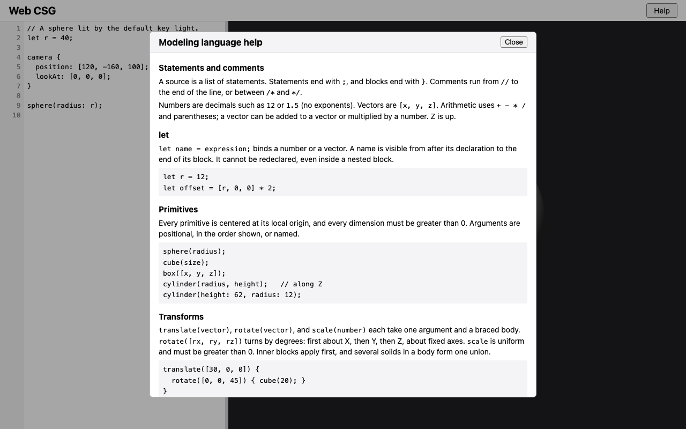
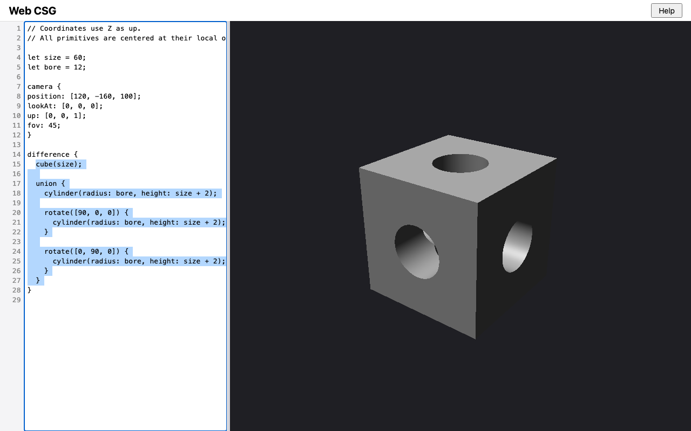

# Backlog close-out: verification evidence

Change: `openspec/changes/backlog-closeout` on branch `backlog-closeout`. It
is a close-out between M5 and M6, not a milestone. Recorded 2026-09-11.
Machine: macOS, Node v22.20.0, npm 10.9.3, `@playwright/test` 1.63.0.

Owner decisions (DESIGN §12 D23):
- **(a) Scope:** close the dev server's dot-paths and its symlinked
  entry-point check, Tab indentation, and on-request help. CI waits for a
  git remote, and point lights stay parked.
- **(b) Tab:** Tab inserts two spaces, or indents each touched line;
  Shift+Tab removes up to two; Esc then Tab leaves the editor.
- **(c) Help:** a Help button opens a modal dialog, and Esc or Close returns
  focus.
- **(d) Undo:** undo treats an indentation edit exactly like typing the same
  characters. This was decided during implementation, after WebKit turned
  out to group typing (see [below](#what-the-implementation-surfaced)).

## Captures

`npm run capture -- backlog-closeout` (Chromium, 1280×800, device scale
factor 1):

| Shot | Shows |
| --- | --- |
|  | `help.png`: the Help dialog, open over the dimmed app. It shows the header's Help button, the "Modeling language help" title with a Close button, and the first sections (Statements and comments, `let`, Primitives, Transforms) with their code samples |
|  | `indented.png`: Tab indentation. The capture first removes two leading spaces from every line of the bored-cube source, which is why the camera block is flush left. It then selects lines 15–27 (the body of `difference`) and presses Tab. Those lines are indented one level again, the selection still covers them, and the model renders |
| `app.png`, `stale.png`, `primitives.png`, `bored-cube.png`, `lit-custom.png` | The earlier shots, unchanged apart from the new Help button in the header |

## Backlog items closed

| Item | Evidence | Result |
| --- | --- | --- |
| The dev server served dotfiles such as `/.git/config` (M0 Critic round 2) | `tools/serve.mjs` returns 404 for any path with a segment starting with `.`, before touching the file system. `test/serve.test.js`: `/.git/config`, `/.gitignore`, `/%2egit/config`, `/%2Egitignore`, and `/sub/.hidden` all get 404, and no file contents leak | Closed |
| Starting `serve.mjs` through a symlinked path under `--preserve-symlinks-main` exited 0 silently (M0 Critic round 6) | `isMainModule()` now compares real paths on both sides. `test/serve.test.js`: through a symlinked checkout with `--preserve-symlinks-main`, the server listens on a valid port and exits 1 on `--port abc` | Closed |
| Tab indents in the editor, with an escape (owner request) | `src/ui/indent.js`, plus the key handling in `src/ui/main.js`. Tested in `test/ui/indent.test.js` and in `e2e/editor-preview.spec.js` on Chromium, Firefox, and WebKit | Closed |
| On-request help for the modeling language (owner request) | `src/ui/help-content.js`, plus the `<dialog>` in `index.html` and `main.js`. Tested in `test/ui/help-content.test.js` and in `e2e/help.spec.js` on all three engines | Closed |
| CI | No git remote yet. The line stays open, noting that it is waiting for one | Open, by decision |
| Point lights | A parked DESIGN feature that needs its own proposal. The line stays open | Open, by decision |

## Gates

| Gate | Result |
| --- | --- |
| `npm run check < /dev/null` in the working tree | On the final tree, after removing the redundant refocus: exit 0, `node --test` 286/286, Playwright 96/96 |
| `openspec validate backlog-closeout --strict` | Valid |
| Full gate from a fresh checkout | Pending at time of writing |
| Manual Safari smoke check | Pass (see below) |
| Separate Critic review returns `[APPROVED]` | Pending |

## Test coverage

| Capability (delta spec) | Tests |
| --- | --- |
| `dev-server` | `test/serve.test.js`: dot-paths get 404, including percent-encoded forms; the CLI works through a symlinked path under `--preserve-symlinks-main`. The existing symlink and port tests still pass |
| `editor-preview`: Tab indentation | `test/ui/indent.test.js` covers: Tab with no selection and with a one-line selection; a multi-line selection, where the selection moves with its text; the column-1 boundary; Shift+Tab with 0–3 leading spaces and across lines; the caret inside the removed spaces. `e2e/editor-preview.spec.js`, on all three engines, covers: Tab inserts two spaces with focus kept; every selected line is indented; Shift+Tab; Esc then Tab leaves the editor with the text unchanged; a rebuild follows; undo matches undo after typed spaces, and is exactly one step in Chromium and Firefox |
| `editor-preview`: Page layout (Help button) | `e2e/editor-preview.spec.js`: the header has a visible, keyboard-focusable Help button |
| `language-help` | `test/ui/help-content.test.js` covers: every reserved word (from `RESERVED_WORDS`) appears; the example compiles and renders; every topic has a section, with the rotation convention, the multi-child difference, and the defaults; backticks are balanced. `e2e/help.spec.js`, on all three engines, covers: opening with the keyboard, where focus moves into the dialog and the title and every topic heading show; Esc, which returns focus to the Help button; Close; and that the source, caret, and rebuild count are unchanged |

## What the implementation surfaced

- **The multi-line Tab test was wrong, not the code.** It expected the
  selection to cover exactly the original text, but indentation inserted
  inside the selection (at the start of line 2) becomes part of it, as in
  common editors. The test and design D-3 now say so.
- **The Help e2e test had a timing flaw.** It recorded the rebuild count
  before the rebuild triggered by its own `fill` had fired. It now waits for
  that rebuild first.
- **WebKit undo.** One undo after Tab reverted more than the indentation.
  - A control experiment ran on all three engines and compared Tab+undo with
    typing two spaces then undo. On every engine the result was identical.
  - In Chromium and Firefox, undo removes just the indentation. WebKit groups
    consecutive typing into one undo step, and it groups the indentation the
    same way.
  - The owner chose to specify that undo treats indentation exactly like
    typing the same characters (D23 d). The test now checks that equality on
    all three engines, and exact one-step undo in Chromium and Firefox.
- **One assertion I wrote could never fail** (`… || true`, in the help
  content tests). It was removed, and the test now checks only what it names:
  balanced backticks.

## Seen to fail

**Unit tests.** Each break was made in a scratch copy of the working tree,
before any commit on this branch. Each run listed `test/serve.test.js`,
`test/ui/indent.test.js`, and `test/ui/help-content.test.js` explicitly. The
baseline was 31/31, and each file was restored after its run.

| Break | Tests that failed |
| --- | --- |
| U1: dot-paths served again | 1/31: `dot-paths get 404 and no file contents…` |
| U2: the real-path comparison reverted | 1/31: `the CLI works through a symlinked path under --preserve-symlinks-main` |
| U3: Tab indents only the first touched line | 2/31: the multi-line Tab test and the column-1 boundary test |
| U4: the column-1 boundary ignored | 1/31: `a selection ending at the start of a line does not touch that line` |
| U5: Shift+Tab removes up to three spaces | 2/31: both Shift+Tab tests |
| U6: the help example made invalid | 1/31: `the help example compiles with no diagnostics…` |
| U7: a reserved word (`intersection`) dropped from the help | 1/31: `the help mentions every reserved word…` |

**End-to-end tests.** These ran in the same kind of scratch copy, with
`node_modules` linked in. Each run covered `e2e/editor-preview.spec.js` and
`e2e/help.spec.js` on Chromium, Firefox, and WebKit, with a baseline of
54/54.

| Break | Tests that failed |
| --- | --- |
| E1: the Esc escape is never armed | 3/54: `Esc, then Tab, leaves the editor with the text unchanged`, on each engine |
| E2: the Tab handler does not intercept Tab | 10/54: the Tab, multi-line Tab, and Shift+Tab tests on each engine, and the undo test in Chromium |
| E3: no explicit refocus after the dialog closes | 0/54, so the mutant survived. All three engines return focus from a closed `<dialog>` by themselves, which made the explicit refocus dead code. It was removed from `main.js` (design D-4 updated), and `e2e/help.spec.js` now checks the browsers' own focus return |

## Manual Safari smoke check

Done on 2026-09-11 by the project owner, in desktop Safari at
`http://127.0.0.1:8080/` (served by `npm start`). **Pass:**
- **Help:** the Help button opens the "Modeling language help" dialog over a
  dimmed page. It scrolls through every section to the example, and Esc
  closes it.
- **Tab:** Tab inserts two spaces with the cursor kept in the editor. With
  several lines selected, Tab indents each one, and Shift+Tab outdents them.
- **Escape:** Esc, then Tab, moves focus out of the editor, with the text
  unchanged.
- **Console:** no errors.
