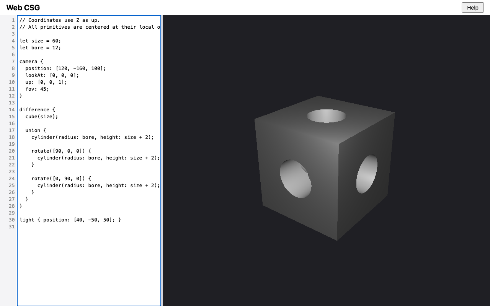

# Point lights: verification evidence

Change: `openspec/changes/point-lights` on branch `point-lights`. It is a
backlog item between M5 and M6, not a milestone. Recorded 2026-09-11.
Machine: macOS, Node v22.20.0, npm 10.9.3, `@playwright/test` 1.63.0.

Decisions (DESIGN §12 D25):
- **(a) Syntax, the owner's decision:** a `light` block has exactly one of
  `direction` (a directional light) or `position` (a point light). Both
  kinds share the limit of 4, and there is no new reserved word.
- **(b) No falloff, the owner's decision:** a point light contributes its
  `intensity` at any distance.
- **(c)–(e) The writer's rules, pending the owner's acceptance:**
  - (c) no occlusion, because shadows stay parked;
  - (d) a point light contributes nothing within `ε` of its position, or at
    a distance too large to compute;
  - (e) the both-properties and neither-property messages.

## Captures

`npm run capture -- point-lights` (Chromium, 1280×800, device scale factor
1):

| Shot | Shows |
| --- | --- |
|  | `lit-point.png`: the bored cube lit only by `light { position: [40, -50, 50]; }`, just outside the corner nearest the camera. Unlike a directional light, which shades each flat face evenly (compare `lit-custom.png`), the point light shades each face unevenly, brightest toward that corner. The top bore's far wall and the walls of the side bores that face the light are lit |
| `app.png`, `stale.png`, `primitives.png`, `bored-cube.png`, `lit-custom.png`, `help.png`, `indented.png` | The earlier shots, unchanged. Directional-only renders are byte-identical: every existing golden still matches |

## Backlog item closed

| Item | Evidence | Result |
| --- | --- | --- |
| Point lights alongside the directional ones (owner request, 2026-09-11; parked in D8) | `src/core/lighting.js` validates `position`, and the rule that a block has exactly one of `direction` and `position`. `lightsAt` in `src/core/shade.js` gives each point light its `L` at the shaded point, and `src/core/render.js` passes it the hit point. Tested as listed below | Closed |

## Gates

| Gate | Result |
| --- | --- |
| `npm run check < /dev/null` in the working tree | Before the first commit: exit 0, `node --test` 302/302, Playwright 108/108 |
| `openspec validate point-lights --strict` | Valid |
| Every existing golden unchanged | `npm test` before any golden update: every golden matched. The only failures were the two tests of changed behavior (the light shape now has `kind`, and the new missing-property message) |
| Full gate from a fresh checkout | Pending |
| Manual Safari smoke check | Pending (see below) |
| Separate Critic review returns `[APPROVED]` | Pending |

## Test coverage

| Scenario (`lighting-and-shading` delta) | Tests |
| --- | --- |
| Declared lights replace the default; light direction; intensity; several lights | The M5 tests in `test/core/lighting.test.js`, unchanged except that the light shape now includes `kind: 'directional'` |
| A point light's direction depends on the shaded point | `lighting.test.js`: `L` at `[0, 0, 0]` and at `[10, 0, 0]`, and the exact Blinn-Phong color at each, with the diffuse term `0.75·C` and `0.75·C/√2` |
| A point light has no falloff | `lighting.test.js`: the same color with the light at 10 and at 1000 units |
| A light inside a solid does not light its outside | `lighting.test.js`: a 32×32 render of `sphere(10)` with a light at its center. Every solid pixel is the ambient `[31, 31, 31, 255]` |
| Solids do not block a light | `lighting.test.js`: a cube between a sphere and the light. Every sphere pixel equals the render without the cube, and the test checks that the light reaches the sphere and that the cube is visible |
| A point at the light receives nothing from it | `lighting.test.js`: offsets 0 and `5e-7` give exactly `0.15·C`. `test/core/shade.test.js`: exactly `ε` (after checking that `length([ε, 0, 0])` is exactly `ε`), 0, and just beyond `ε` |
| Point and directional lights together | `lighting.test.js`: the 1×1 render equals shading with both lights and no key light, and equals ambient plus each light's own contribution |
| A scaled scene with a point light renders the same | `test/core/scaled-render.test.js`: at ×1e-3 and ×1e5. Measured before the test was written: byte-identical, 0 of 12,288 channels differ at either factor |
| Light validation (the M5 table rows) | The M5 tests, with the missing-property message updated |
| Both kinds share the limit | `lighting.test.js`: three directional and two point lights report the fifth; two of each are valid, in order |
| A missing direction is reported | `lighting.test.js`: "light block is missing `direction` or `position`" at the block |
| Direction and position together | `lighting.test.js`: in each order, reported at the second, with the `direction` check still reported |
| A point light accepts any position; position must be a vector | `lighting.test.js`: `[0, 0, 0]` inside a sphere gives no diagnostics and a point light; `position: 5`; a duplicate `position`; an unknown `range` |
| Extreme directions | The M5 test, unchanged |
| `lightsAt` details (design D-2) | `shade.test.js`: a non-finite distance (`[1e308, 0, 0]` from `[-1e308, 0, 0]`), a finite difference whose length overflows, the unit vector toward `[3, 4, 12]`, and directional lights passed through as the same object |
| Help (`language-help`, content only) | `test/ui/help-content.test.js`: the `light` section says "exactly one of `direction` or `position`, not both", "equally bright at any distance", and "cast no shadows" |
| Golden `lit-point` | `test/core/lighting-golden.test.js`, 64×48. The image was reviewed: the shading varies across each face, unlike `lit-one` |

## Seen to fail

In an isolated copy (rsync of the working tree, with `node_modules`
symlinked), with the test files listed explicitly: `lighting.test.js`,
`shade.test.js`, `scaled-render.test.js`, and `lighting-golden.test.js`. The
baseline was 48 pass, 0 fail. The copy was removed afterwards.

| Mutant | Failing tests | Result |
| --- | --- | --- |
| M1: `lightsAt` drops every point light | 7: the `lit-point` golden, the direction, no-falloff, not-blocked, and mixed-lights scenarios, and two `lightsAt` tests | Killed |
| M2: a point light falls off as `1/r²` | 7: the golden, direction, no falloff, not blocked, the ×1e-3 scaled render, and two `lightsAt` tests | Killed |
| M3: the `ε` rule becomes `r === 0` | 2: a point at the light, and the `ε` boundary test | Killed |
| M4: `L` points from the light to the point | 7: the golden, direction, no falloff, the inside-a-solid and mixed-lights scenarios, and two `lightsAt` tests | Killed |
| M5: the hit point uses `t` without the ray direction | 3: the golden, inside a solid, and mixed lights | Killed |
| M6: the both-properties rule is removed | 1: the both-properties test | Killed |
| M7: the both-properties rule reports at the first property | 1: the both-properties test | Killed |
| M8: the neither-property rule keeps the old message | 1: the missing-property test | Killed |
| M9: the non-finite distance rule is removed | 1: the too-large-distance `lightsAt` test | Killed |

Under M2, the ×1e5 scaled render still passed: with `1/r²` falloff, both
that render and the unscaled one are close to ambient. The other six tests
catch M2.

## What the implementation surfaced

- **The scaled render is exact.** The spec allows 1 per channel, but the
  point-lit bored cube at ×1e-3 and ×1e5 is byte-identical to ×1. So the
  risk recorded in design D-4 did not arise.
- **The golden's first light position was on a face.** The draft design put
  the light at `[0, -30, 20]`, which lies in the cube's front face
  (`y = -30`). This was caught while writing the proposal, before any code,
  and changed to `[40, -50, 50]`, outside the three visible faces.
- **A MODIFIED requirement keeps its scenario names.** `openspec validate`
  rejected renaming "A missing direction is reported", so the scenario keeps
  its name with the new message.

## Manual Safari smoke check

Pending. The owner pastes this scene into the app in Safari:

```text
camera { position: [120, -160, 100]; lookAt: [0, 0, 0]; }
difference {
  cube(60);
  cylinder(radius: 12, height: 62);
}
light { position: [40, -50, 50]; }
material { color: [0.95, 0.55, 0.15]; }
```

Expected: an orange cube. Each face is shaded unevenly, brightest toward the
corner nearest the camera. Changing `position` to `direction` shows a
directional light instead. Adding `direction: [0, 0, -1];` next to
`position` shows the diagnostic "light block cannot have both `direction`
and `position`" at `direction`.
